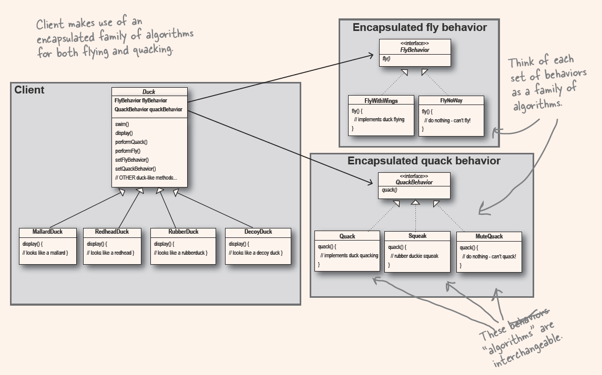

Head first - Design Pattern
2025-09-19

Chapter 1:

Duck has a lot of fly behaviors, some fly quick, some slow, and some don't fly at all.
encapsulate the fly behaviors, and PLUG it into the duck (composition), 
then the duck can have different flying behavior, which even can change on the fly.

Design Principle
  1. Encapsulate what varies.

    Identify the aspects of your application that vary and separate them from what stays the same.
    In other words:
      Separting what changes from what stays the same

  2. Program to interface, not implementation.

  3. Favor composition over inheritance.

The Strategy Pattern
  - define a family of algorithms, encapsulates each one, and makes them interchangable.
  - Strategy lets the algorithm vary independently from clients that use it.

Design pattern
  - a shared vocabulary with other devs
  - first into your BRAIN, then apply to your new design, then CODE

GOAL
  - How to create flexible designs that are maintainable and can cope with change.( thinking what might change in the future )

