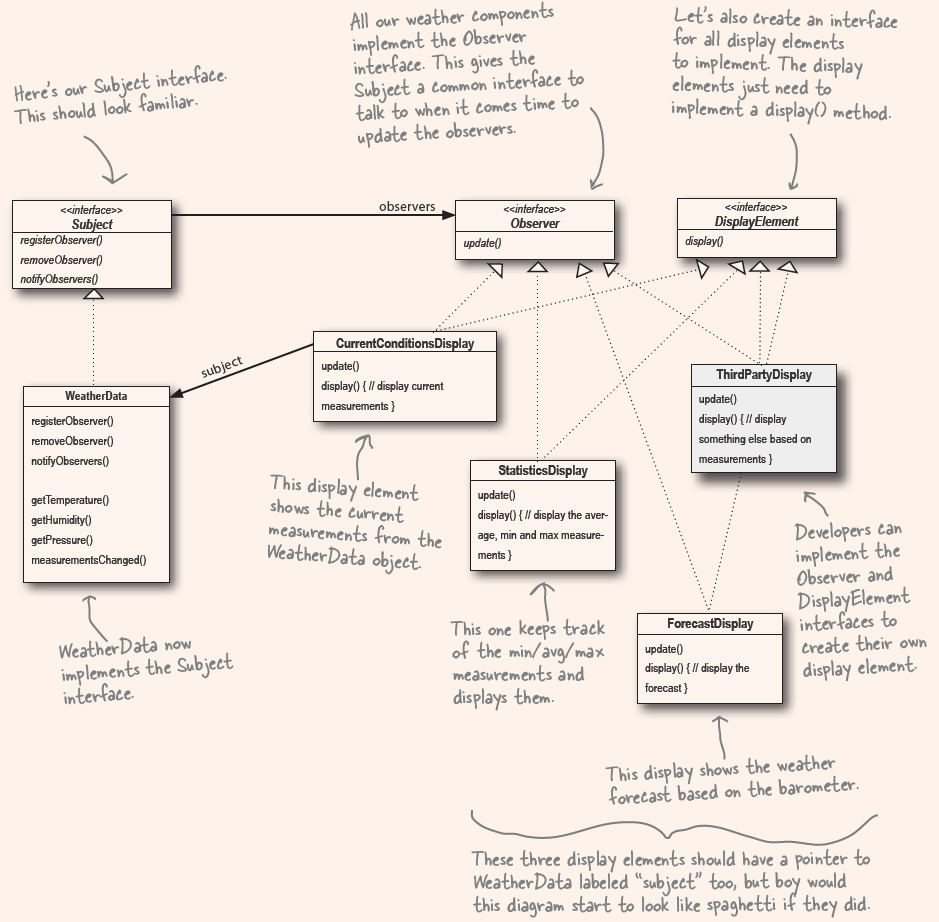

chapter 2 Observer Pattern

1. one-to-many relationships

2. loose coupling
  - not knowing too much about other objects

3. The Observer Pattern
  - A one-to-many dependency between objects so that when one object changes state, all of its dependentis are notified and updated automatically.
    a: one-to-many
    b: one changes, many get notified

4. Design Principle
  - Strive for loosely coupled designs between objects that interact.

5. Subject can push, Observers also can pull, and the update function much more cleaner and easier to extent in the future.

6. Lots of the library use this pattern
  - document.addEventListner()
    - document is the subject, 
    - listner is the observer
    - this addEventListner add the will performed action into the observers' list
    - in the notify function of document, invoke the Observer's interface action(like actionPerformed) for each observer in list
    - when some event happen(e.g. load, invoke the notify -> listners got actionPerformed invoked respectively)

