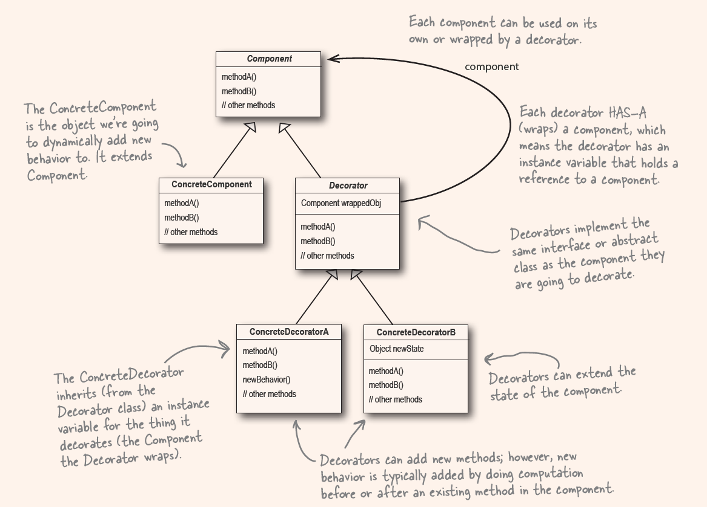

1. Design Principle (Open-Closed Principle)
  - Classes should be open for extension, but closed for modification.
  - You cannot apply the principle in everywhere of your code, add an extra level of abstraction
  - Concentrate on those that are most likely to change

2. Wrapper
  - Think of decorator objects as "wrapper"

3. 'mirror'
  - The decorator mirros the object it is decorating.
  - By 'mirror', we mean it is the same type.
  - inherited from the same super class or interface.

4. 
  - Decorator has the same super type as the object they decorated.
  - one or more decorators.
  - can pass around a decorated object in place of the original object.
  - decorator add its own behavior --> delegate the wrapped object to do the other works.
  - can be decorated at runtime.

5. The Decorator Pattern
  - attaches additional responsibilites to an object dynamically.
  - Decorators provide a flexible alternative to subclassing for extending functionality.

  