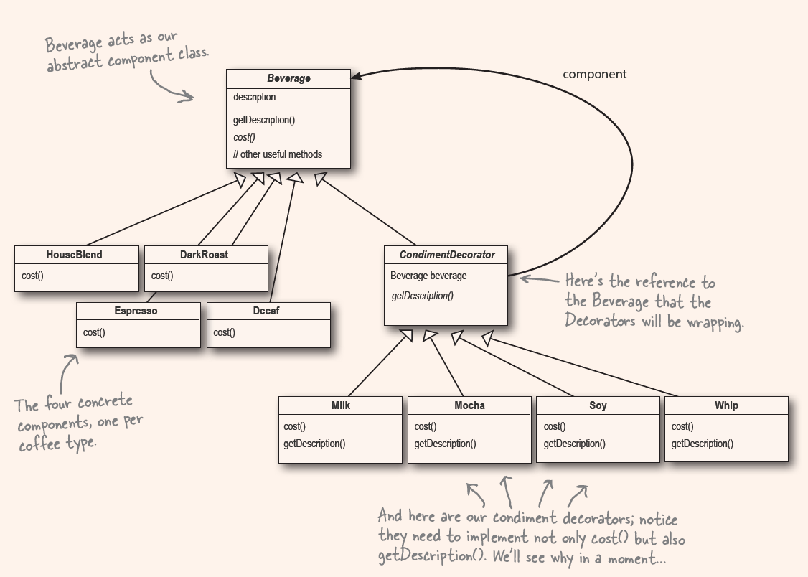

1. Design Principle (Open-Closed Principle)
  - Classes should be open for extension, but closed for modification.
  - You cannot apply the principle in everywhere of your code, add an extra level of abstraction
  - Concentrate on those that are most likely to change

2. Wrapper
  - Think of decorator objects as "wrapper"

3. 'mirror'
  - The decorator mirros the object it is decorating.
  - By 'mirror', we mean it is the same type.
  - inherited from the same super class or interface.

4. 
  - Decorator has the same super type as the object they decorated.
  - one or more decorators.
  - can pass around a decorated object in place of the original object.
  - decorator add its own behavior --> delegate the wrapped object to do the other works.
  - can be decorated at runtime.

5. The Decorator Pattern
  - attaches additional responsibilites to an object dynamically.
  - Decorators provide a flexible alternative to subclassing for extending functionality.
  - 通过继承来实现type matching, not extendiong functionality, decorator needs to has the same type as the object they decorated, VITAL!

6. Two important things:
  a. The abstract(or interface) decorator needs to inherit from the object it wants to decorate, because the decorator wants to become the component it wraps.（成为他）

  b. The abstract(or interface) decorator needs to have a reference to the component it wraps, so the concrete docorator can have the component's functionalities, then add it's own decorator before or after (or even in place of) the component's functionalities, compose a more beautiful (after decorated) component.

7. Real world example
  - Java I/O libraries, - a set of wrappers around InputStream

8. Decorator - subclassing for extending functionality

keep your chin up and think positively!

The definition:

For the coffee shop:
