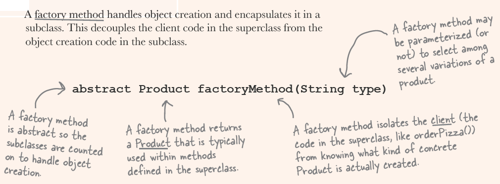
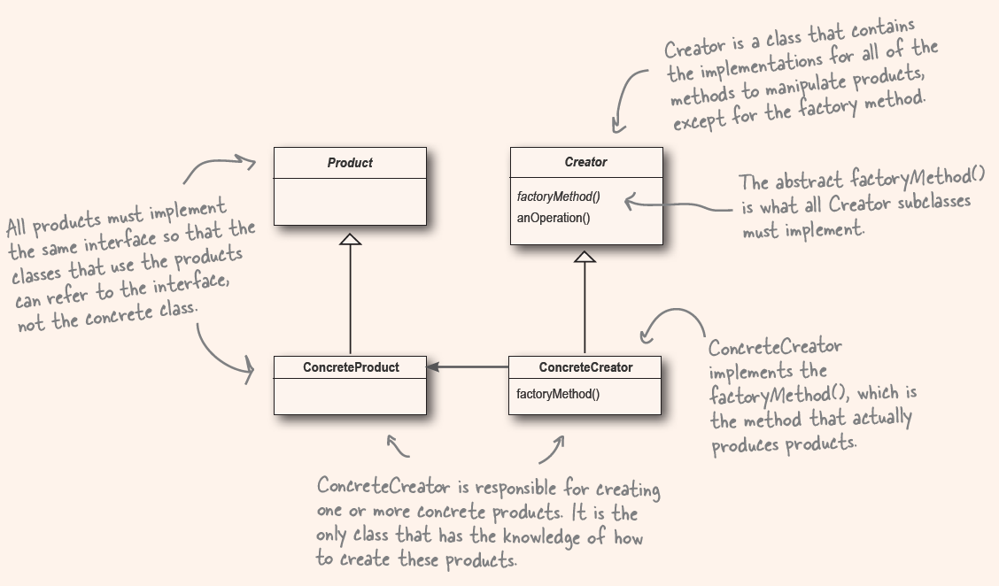

1. Simple factory

- encapsulate the creation into another class
- inject the new created factory class into its client (where to use)
- invoke the factory functionality to create the object client wants
- The factory often be static method, so there's no new key word anymore.(can see a lot in the real-world, but actually it's not a factory at all)
  
  

2. Factory Method Pattern (Abstract factory in superclass, subclass to implement)

- delegate the creation functionality to the subclass and having an abstract create method in superclass
- superclass is the client and using the functionality from subclass to create the object

3. Offical definition

- Define an interface for creating an object, but lets subclasses decide which class to instantiate.
- Factory Method lets a class defer instantiation to subclasses.
